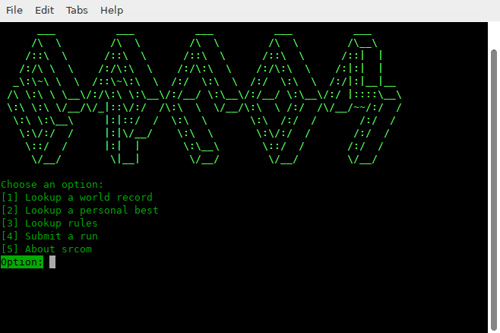
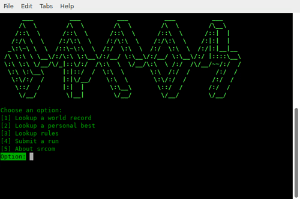

# srcom

A Node.js module that provides you with the ability to look up runs and rules from speedrun.com using the command line, in addition to posting runs.





## Prerequisites

[Node.js](https://nodejs.org/en/download/) installed.

## Installation

```
npm i -g srcom
```

## Usage

Type `srcom` in a terminal/command line and follow the prompts.